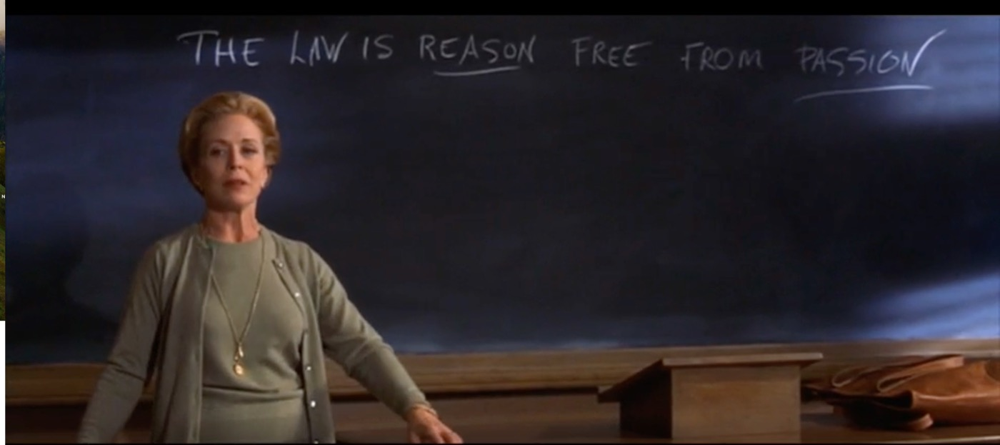
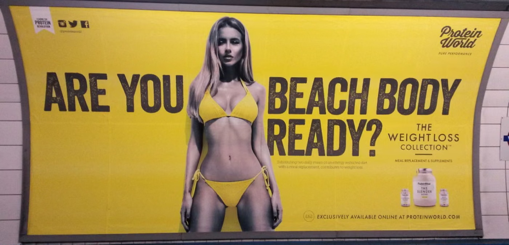
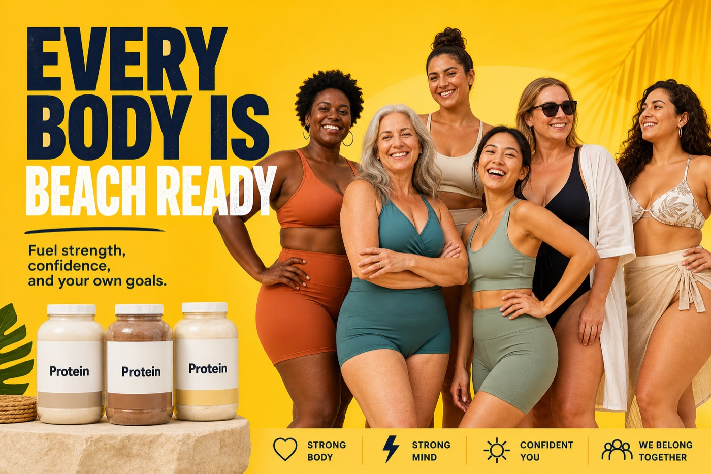
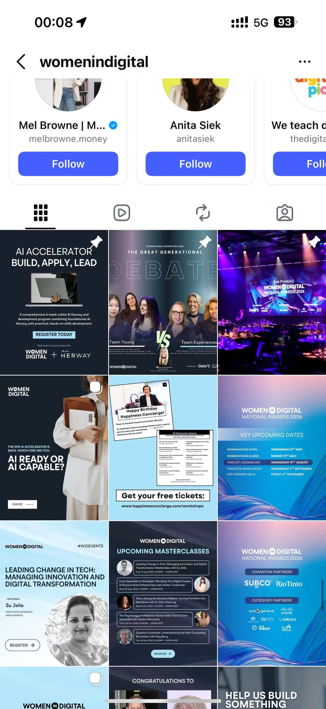
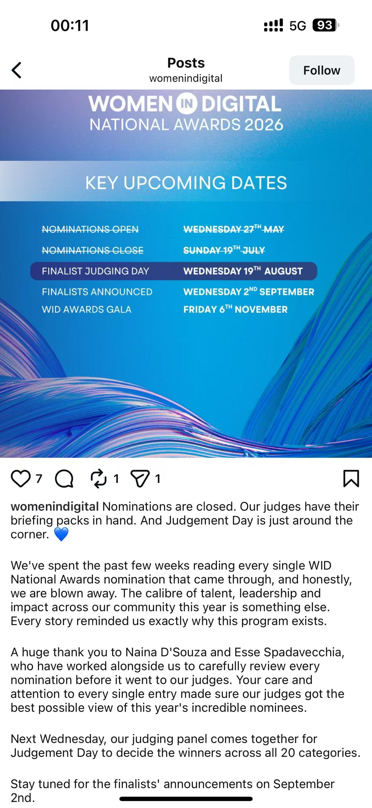
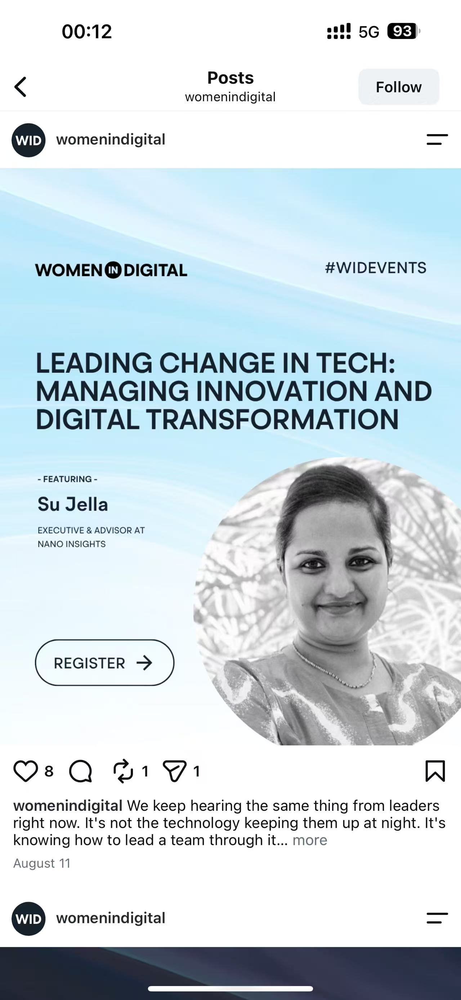

# QUT005 Assignment Requirements 2026

## Summary

This document organises QUT005 assignment materials for analysing power, privilege, identity, and representation in communication. It includes selected evidence for Part A, Part B, and Part C, including screenshots, URLs, timestamps, sample details, and academic references.

## Core Focus

This assignment asks you to analyse how power and privilege operate through communication. Across all three parts, your writing should explain how social identities shape communication, representation, authority, credibility, visibility, and belonging.

Relevant social identities may include gender, race, class, disability, age, sexuality, culture, religion, migration status, and Indigeneity.

The key point is not simply to identify who has formal authority. You need to explain how identities and wider systems of power influence whose voices are heard, whose expertise is valued, who is represented as belonging, and who is marginalised or absent.

## Overall Requirements

- Part A: 500 words +/-10%.
- Part B: 500 words +/-10%.
- Part C: 500 words +/-10%.
- References: at least 9 sources total, with at least 3 sources for each part.
- Referencing style: APA.
- Submission format: PDF.
- File name: `FIRSTNAME_LASTNAME_STUDENTNUMBER.pdf`.

## Part A: Interpersonal Communication Scene Analysis

### Task

Analyse a short scene from a movie or TV show and explain how social identities create or reinforce power and privilege in interpersonal communication.

### Selected Part A Scene

- Movie/TV show: *Legally Blonde*.
- Year: 2001.
- Scene: Kicked Out of Class.
- URL: https://www.rottentomatoes.com/m/legally_blonde/videos/KDeyZeSgnBem
- Timestamps: 0:00-2:47.
- Key identities: gender, femininity, appearance, and professional identity.
- Main power issue: the scene shows how gendered expectations shape professional belonging. Although Elle is formally admitted to Harvard Law, her feminine appearance, clothing, and social style make others treat her as less serious and less competent before her ability is fully recognised.

### Required Details

- Paste an image from the start of the scene.
- Include the URL.
- Include precise timestamps.
- Scene should be 2-3 minutes.
- Movie or TV show must be from 2000 onwards.
- Scene must include human characters.

### Do Not Choose

- dystopian, futuristic, or imagined alternative societies;
- cartoons or animations;
- fantasy races, magical characters, or superheroes;
- stories centred on non-human characters, such as Barbie;
- examples discussed by teaching staff, such as Hidden Figures;
- scenes that are only about role-based authority, such as boss versus employee.

If the scene includes a boss, teacher, doctor, police officer, or other authority figure, the analysis must go beyond role authority and explain how social identities affect the interaction.

### Word Count

- Context analysis: 100 words +/-10%.
- Power dynamic analysis: 400 words +/-10%.
- Total Part A: 500 words +/-10%.

### Context Analysis

Briefly describe the scene and identify the social identities relevant to the interaction. Explain how these identities shape power and privilege.

Discuss contextual factors only when they help explain who has power, who is marginalised, or whose voice is valued. Relevant context may include time, place, social situation, culture, laws, institutional setting, or historical background.

You may briefly acknowledge how your own perspective could shape your interpretation if relevant.

### Power Dynamic Analysis

Analyse how social identities create or reinforce power and privilege in the interaction. Focus on how communication shows unequal power.

Consider:

- which identities are privileged or marginalised;
- who is believed, respected, interrupted, ignored, stereotyped, or controlled;
- who is allowed to speak, question, explain, challenge, or remain silent;
- whose knowledge, emotion, or experience is treated as valid;
- whose perspective is dismissed, minimised, or controlled;
- how verbal and non-verbal communication reinforces power and privilege;
- how the interaction reflects broader social inequalities beyond the scene.

### Evidence

Use at least 3 academic or scholarly sources. Sources should help explain concepts such as power, privilege, intersectionality, stereotyping, identity, marginalisation, belonging, or discrimination.

### Part A Checklist

- Screenshot, URL, and precise timestamp included.
- Scene is from 2000 onwards and includes human characters.
- Scene avoids all prohibited categories.
- Analysis focuses on social identities, power, and privilege, not only role hierarchy.
- Context analysis is about 100 words.
- Power analysis is about 400 words.
- Three or more scholarly sources are cited in text and listed in APA style.
- References are real, relevant, and checked.

## Part B: Static Advertisement Stereotype Analysis

### Task

Analyse a static advertisement from 2000 onwards that communicates a stereotype about one or more marginalised identities connected to Part A. Then create a new advertisement that challenges the stereotype.

### Selected Part B Advertisement

- Original advertisement: Protein World - Are You Beach Body Ready?
- Year: 2015.
- URL: https://www.theguardian.com/lifeandstyle/womens-blog/2015/jul/03/the-week-in-feminist-news-the-beach-body-ad-lives-on
- Access date: 20 August 2026.
- Connected identity from Part A: gender, femininity, appearance, and social/professional belonging.
- Stereotype / assumption: women are expected to make their bodies visually acceptable for public display, with a slim, toned body presented as the standard of confidence, beauty, and social acceptability.

### Required Details

- Paste the original advertisement image.
- Include the URL.
- Include the access date.
- Paste the new advertisement image.
- If using Unsplash, provide the image reference and search terms used.

### Suitable Advertisements

- print advertisements;
- billboard advertisements;
- magazine advertisements;
- online display advertisements;
- static social media advertisements.

### Do Not Use

- stock photos;
- screenshots from TV or video advertisements;
- cartoons;
- stills from movies or TV shows;
- public images that are not advertisements;
- advertisements discussed by teaching staff;
- images that do not clearly communicate a stereotype.

### Word Count

- Image analysis: 450 words +/-10%.
- New image rationale: 50 words +/-10%.
- Total Part B: 500 words +/-10%.

### Image Analysis

Identify the stereotype and explain how it is visually encoded in the advertisement.

Visual encoding may include:

- who is shown and who is missing;
- who is centred or placed in the background;
- body posture;
- facial expression;
- clothing;
- colour;
- lighting;
- composition;
- setting;
- objects or symbols;
- text, slogans, or captions;
- who appears active, passive, competent, dependent, threatening, emotional, or in control.

Explain how repeated exposure to similar stereotypes can reinforce or normalise unequal power and privilege in Australian society.

The analysis should connect the stereotype to real social effects, such as:

- social attitudes;
- workplace opportunities;
- leadership assumptions;
- wages;
- safety;
- health;
- education.

### Evidence

Use at least 3 sources:

- at least 1 relevant government, institutional, or official statistical source showing the issue's impact in Australia;
- at least 2 academic or scholarly sources.

### New Advertisement Rationale

Create a new advertisement that challenges the identified stereotype. The new image should align with the original product, service, or message, but change who is represented or how the group is represented.

The rationale should explain what changed and how those changes counter the original stereotype.

### Part B Checklist

- Original static advertisement pasted with URL and access date.
- Advertisement is from 2000 onwards.
- Advertisement is not a prohibited image type.
- Image analysis is about 450 words.
- Analysis explains how the advertisement communicates the stereotype.
- Analysis explains how repeated stereotypes reinforce or normalise power and privilege in Australian society.
- Analysis uses evidence about impacts in Australia.
- New advertisement image pasted.
- Rationale is about 50 words.
- At least 1 official/statistical source and at least 2 scholarly sources are cited and listed in APA style.
- References are real, relevant, and checked.

## Part C: Professional Communication Representation Analysis

### Task

Analyse representation patterns in the social media communication of a professional peak body, society, or accredited body connected to your future profession. Explain how these patterns shape perceptions of competence, leadership potential, and belonging.

### Required Details

- Paste screenshots showing the start of the social media feed and several sampled posts.
- State the platform and handle.
- Include the URL.
- Include the date range.
- Include the number of posts showing people that were sampled.

### Selected Materials

- Professional body / network: Women in Digital.
- Platform: Instagram.
- Handle: @womenindigital.
- URL: https://www.instagram.com/womenindigital/
- Access date: 21 August 2026.
- Date range sampled: recent posts visible in August 2026.
- Sample size: 20 recent Instagram posts showing people or professional representation.
- Connected identity from Parts A and B: gender, femininity, professional competence, leadership, and belonging.
- Representation focus: how Women in Digital visually and textually represents women and other professionals in digital and technology spaces as experts, leaders, award nominees, speakers, and community members.

#### Screenshot 1: Instagram Feed Overview

This screenshot shows the @womenindigital Instagram feed grid and provides evidence of the sampled social media context.

#### Screenshot 2: Women in Digital National Awards 2026

This screenshot shows a post about the Women in Digital National Awards 2026 judging process, highlighting professional recognition, leadership, judging, and achievement within the digital community.

#### Screenshot 3: Leading Change in Tech - Su Jella

This screenshot shows Su Jella, Executive and Advisor at Nano Insights, being represented as a professional speaker and expert in innovation and digital transformation.

#### Screenshot 4: Upcoming Masterclasses

This screenshot shows multiple professionals presented as masterclass speakers, including Su Jella, Ashton Tuckerman, Dr Ellen Manning, Sandra Moscardo, and Guy Barry. It is useful for analysing who is positioned as expert, credible, and visible in professional learning spaces.

### Organisation Requirements

Choose a professional body connected to your future profession. It should represent, accredit, or support people already working in the profession.

Do not use:

- commercial companies that employ people in the profession;
- recruitment companies;
- client-focused organisations where posts mainly show clients or customers.

### Sample Requirements

- Select one social media platform with a substantial public presence, such as LinkedIn, Instagram, Facebook, X, Bluesky, or TikTok.
- Analyse a meaningful sample of recent posts.
- As a guide, examine at least 20 posts that include people in your future profession.
- Focus only on professionals already in, or visibly associated with, the profession.

### Word Count

- Representation analysis: about 500 words +/-10%.
- Allyship recommendation: 60-80 words.

### Representation Analysis

Identify repeated patterns across the sample, not one-off examples.

Consider:

- who is repeatedly visible;
- who appears in leadership, expert, or speaking roles;
- who is shown as junior, passive, peripheral, or absent;
- whose names, titles, or achievements are highlighted;
- whose expertise is validated through captions, hashtags, awards, or event promotion;
- whether the communication reflects diversity within the profession;
- what identities appear absent or underrepresented;
- whether diversity appears in everyday professional posts, leadership posts, and expert posts, or mainly in group photos, special events, awareness days, or diversity-focused posts.

If identities such as LGBTQIA+ identity, Indigeneity, chronic illness, religion, or non-visible disability are not visible or communicated through captions, profiles, hashtags, events, or self-identification, you can state that they are not clearly represented in the sample.

Evaluate the implicit message the feed communicates about which professionals belong and are likely to succeed in the profession. Consider impacts on current professionals and people aspiring to enter the field.

### Evidence

Use at least 3 academic or scholarly sources.

### Allyship Recommendation

End the analysis with a practical recommendation to the professional body. Frame this as an allyship action and make sure it responds directly to the representation patterns found.

### Part C Checklist

- Professional body feed image pasted.
- Platform, handle, URL, date range, and number of posts analysed are stated.
- Analysis is about 500 words.
- Patterns are identified across recent content.
- Analysis identifies who is centred, marginalised, or absent.
- Impacts are considered for current professionals and aspiring entrants.
- Allyship recommendation is 60-80 words.
- Three or more scholarly sources are cited in text and listed in APA style.
- References are real, relevant, and checked.

## References Collected

### Part A References

Glick, P., Larsen, S., Johnson, C., & Branstiter, H. (2005). Evaluations of Sexy Women In Low- and High-Status Jobs. *Psychology of Women Quarterly, 29*(4), 389-395. https://doi.org/10.1111/j.1471-6402.2005.00238.x

Fleischmann, A., Sieverding, M., Hespenheide, U., Weiss, M., & Koch, S. C. (2016). See feminine - Think incompetent? The effects of a feminine outfit on the evaluation of women's computer competence. *Computers and Education, 95*, 63-74. https://doi.org/10.1016/j.compedu.2015.12.007

Heilman, M. E. (2012). Gender stereotypes and workplace bias. *Research in Organizational Behavior, 32*, 113-135. https://doi.org/10.1016/j.riob.2012.11.003

### Part B References

Grabe, S., Ward, L. M., & Hyde, J. S. (2008). The Role of the Media in Body Image Concerns Among Women: A Meta-Analysis of Experimental and Correlational Studies. *Psychological Bulletin, 134*(3), 460-476. https://doi.org/10.1037/0033-2909.134.3.460

Groesz, L. M., Levine, M. P., & Murnen, S. K. (2002). The effect of experimental presentation of thin media images on body satisfaction: A meta-analytic review. *The International Journal of Eating Disorders, 31*(1), 1-16. https://doi.org/10.1002/eat.10005

Santoniccolo, F., Trombetta, T., Paradiso, M. N., & Rolle, L. (2023). Gender and Media Representations: A Review of the Literature on Gender Stereotypes, Objectification and Sexualization. *International Journal of Environmental Research and Public Health, 20*(10), Article 5770. https://doi.org/10.3390/ijerph20105770

Australian Institute of Health and Welfare. (2026). *Health of young people*. Australian Government. https://www.aihw.gov.au/reports/children-youth/health-of-young-people

### Part C References

Nagpal, M., Cao, J., Mai, K. M., & de Cremer, D. (2023). How Can Women Take Advantage of the High-Tech Era to be Perceived as Effective Leaders? Being Tech-Savvy Helps. *Journal of Leadership & Organizational Studies, 30*(4), 397-412. https://doi.org/10.1177/15480518231200618

Bairoh, S. (2024). "It is competence first": executives navigating gender equality targets and meritocracy in technology companies. *Gender in Management, 39*(4), 590-605. https://doi.org/10.1108/GM-05-2022-0172

Wu, X., Almeida, S., Schulz, R., & O'Brien, M. (2026). Barriers and inclusive initiatives: A systematic literature review of women's employment in science, technology, engineering, and mathematics workplaces. *The Economic and Labour Relations Review: ELRR, 37*(1), 27-45. https://doi.org/10.1017/elr.2026.10064

## Marking Rubric

### Part A

#### Meets Expectations

Context analysis is succinct and insightful, identifying salient identities and situational factors that make power visible. Critical analysis provides a clear, conceptually grounded account of who holds power, how it is communicated verbally and non-verbally, and whose perspectives are validated, using evidence-based knowledge and ideas from the academic literature, which are acknowledged through accurate citation and referencing. Scene selection is appropriate, with a precise screenshot, URL, and timestamps. The word count has been adhered to, and all AI use has been documented appropriately.

#### Does Not Meet Expectations

Context analysis is limited, omitting key identities or situational factors that make power visible. Power analysis lacks clarity and depth, providing a superficial or descriptive account of power dynamics, with minimal or no reference to relevant academic concepts, theories, or evidence-based sources. Scene selection is inappropriate, incomplete, or missing key elements such as a screenshot, URL, or timestamps. Word count is exceeded or significantly underutilised, and AI use is not documented or insufficiently explained.

### Part B

#### Meets Expectations

The original image meets recency (from 2000 onwards) and format constraints and is properly referenced with the URL and access date. A credible perceived bias or assumption towards a group (same marginalised identity chosen in Part A) is clearly identified from the image. Critical analysis demonstrates an in-depth understanding of the biased message and explains how it contributes to power and privilege disparities within Australian society. The analysis uses evidence-based knowledge and ideas from the academic literature, which are acknowledged through accurate citation and referencing. The reimagined image effectively reduces or removes the identified biased message, and the accompanying rationale clearly explains the changes made and their impact. The word count is adhered to, and all AI use is documented appropriately.

#### Does Not Meet Expectations

The original image does not meet recency or format constraints, or is missing proper referencing, including URL and access date. The identification of bias or assumption is unclear, incomplete, or lacks credibility. Analysis of the biased message is superficial, descriptive rather than critical, or does not sufficiently explain how the bias contributes to power and privilege disparities within Australian society. Minimal or no use of academic literature results in unsupported claims, and citation or referencing is inaccurate or missing. The reimagined image does not effectively address the identified bias, and the rationale is vague, incomplete, or absent. The word count is exceeded or significantly underutilised, and AI use is undocumented or insufficiently explained.

### Part C

#### Meets Expectations

The platform and handle are appropriate for a professional peak body, with clear details provided for the URL, date range, and sample size. Critical analysis clearly identifies who is centred versus marginalised or absent across visual and textual content, drawing patterns that are supported by quantitative or well-justified qualitative sampling. Findings are explicitly linked to concepts of competence, leadership potential, and belonging. The analysis incorporates evidence-based knowledge and ideas from the academic literature, which are acknowledged through accurate citation and referencing. The task concludes with a specific and feasible allyship recommendation of 60 to 80 words. The word count is adhered to, and all AI use is documented appropriately.

#### Does Not Meet Expectations

The platform and handle are inappropriate, or key details such as the URL, date range, or sample size are unclear or missing. The analysis lacks clarity in identifying who is centred versus marginalised or absent, and patterns are either unsupported or inadequately explained, with no quantitative or qualitative justification. Findings are not clearly linked to concepts of competence, leadership potential, or belonging. Minimal or no use of academic literature results in unsupported claims, and citation or referencing is inaccurate or missing. The allyship recommendation is absent, overly vague, or not feasible. Word count is exceeded or significantly underutilised, and AI use is undocumented or insufficiently explained.

## Final Submission Checklist

- Delete all guidance text from the assignment template before submitting.
- Check each part meets the word count.
- Check each part has the required images, URLs, dates, timestamps, or sample details.
- Check each part uses the required evidence.
- Check all in-text citations and reference list entries are APA style.
- Check all references are real and relevant.
- Export as PDF.
- Name the file `FIRSTNAME_LASTNAME_STUDENTNUMBER.pdf`.
